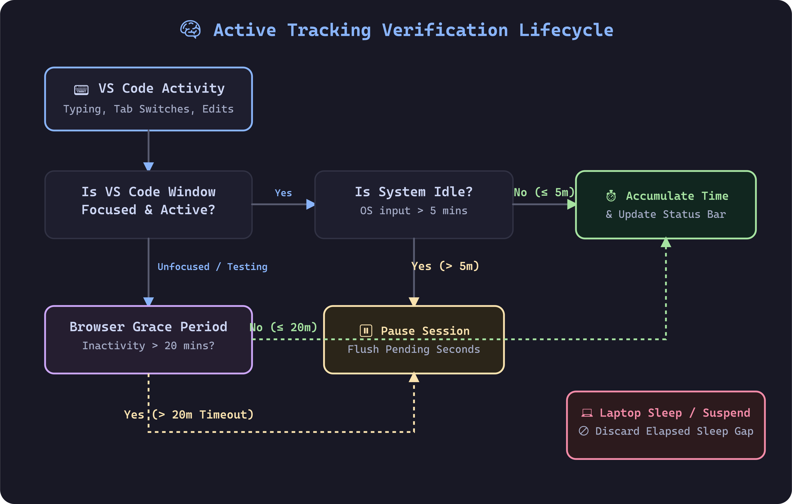
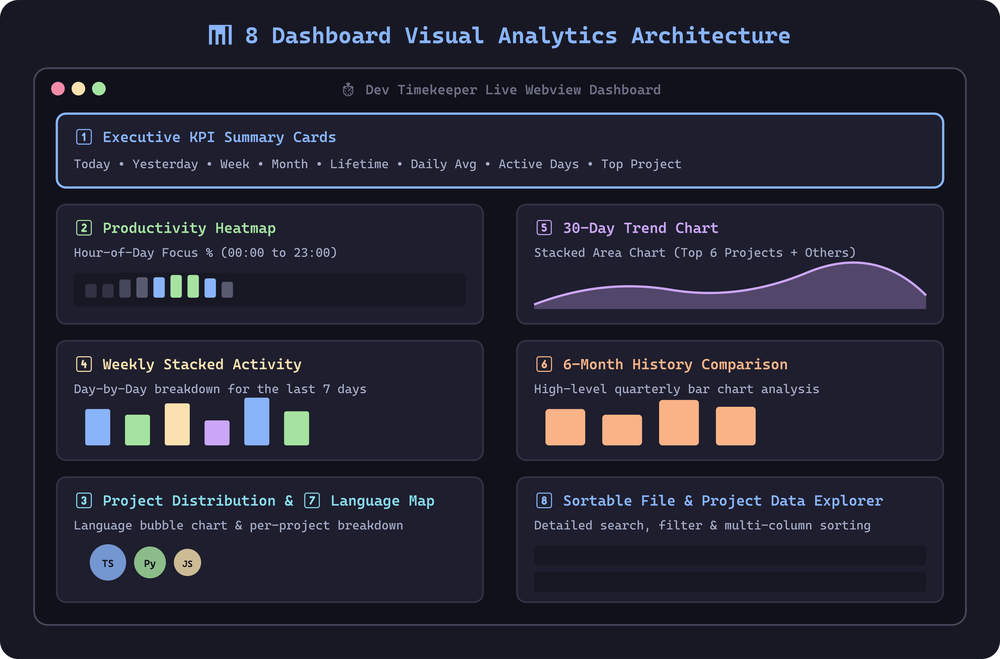
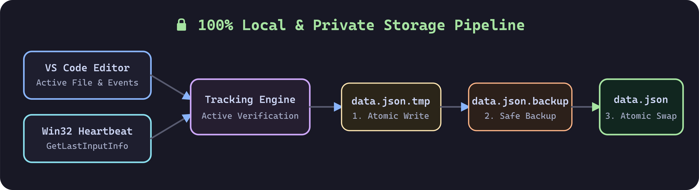

# ⏱️ Dev Timekeeper — Features & Capabilities

> **Dev Timekeeper** is a private, offline-first developer productivity extension for VS Code and VSCodium. It automatically tracks active coding time per file, folder, workspace, day, and hour with zero cloud dependencies and zero telemetry.

---

## ⚡ Active Tracking Engine

Unlike basic activity timers that continuously increment whenever VS Code is open, **Dev Timekeeper** uses multi-layered active-time verification.

### Key Tracking Capabilities:
- **OS-Level Idle Detection**: Lightweight background process (`scripts/heartbeat.ps1`) monitoring Win32 `GetLastInputInfo` system input timeouts. Pauses tracking after **5 minutes** of no keyboard or mouse movement across the operating system.
- **20-Minute VS Code Inactivity Hard Limit**: Tracks active timestamps for editor interactions (keystrokes, tab switches, file saves, and agent edits). Allows a **20-minute grace period** for external testing (e.g., in Chrome or terminal) before auto-pausing.
- **Window Minimization & Focus Awareness**: Instantly pauses accumulation when VS Code is minimized or loses focus.
- **Sleep & Suspension Rejection**: Automatically detects system sleep or laptop suspension gaps upon wakeup and discards non-coding sleep intervals.

---

## 🔄 Multi-Instance & Cross-Editor Synchronization

Developers frequently run multiple editors simultaneously (e.g. VS Code alongside Antigravity, or multiple VS Code windows for different microservices). **Dev Timekeeper v1.1.0** introduces a zero-conflict multi-instance coordination layer:

- **Active Session Lease (`active_session.json`)**: Whenever you focus, type, or save a file in any IDE window, that window immediately claims the active session. Other open windows detect the lease and pause tracking, guaranteeing that 1 physical hour of coding strictly counts as 1 hour—with zero double-counting or parallel inflation.
- **Atomic Mutex & Deadlock Immunity (`data.json.lock`)**: High-throughput file locking using OS-level exclusive file creation with exponential backoff and automatic 3-second stale lock reclamation. Eliminates race conditions, write collisions, and Windows `EBUSY` file errors.
- **Singleton Heartbeat Manager**: Background Win32 idle monitoring automatically elects a single active daemon across all open windows, eliminating duplicate PowerShell processes.
- **Strict 3,600s Clock Hour Boundary**: Mathematical clamping ensures that an hour bucket on any calendar day never exceeds 3,600 seconds, keeping hourly productivity heatmaps physically accurate.
- **Live Cross-Instance Dashboard Sync**: The webview dashboard panel automatically detects database updates from other windows and debounces a live refresh.

---

## 🗂️ Project Groups & Multi-Repo Aggregation

Many real-world projects span multiple repositories, microservices, or versioned directories (e.g. `frontend`, `backend`, `v2`, `v3`). Rather than splitting your metrics into fragmented rows, **Dev Timekeeper** provides native project grouping:

- **Aggregated Analytics**: Dashboard charts (lifetime distribution, 7-day stacked activity, 30-day trends, and weekly top 5) aggregate grouped projects automatically.
- **Accordion Project Details Table**: Toggle between **Grouped** and **Individual** views. Group rows expand to reveal each sub-repo with its percentage share of total group time.
- **Smart Detection**: Heuristic stem analysis detects related project folders (e.g., `elina_legal_ai_v2` and `v3`) and suggests grouping with one click.
- **Safe & Non-Destructive**: Groups are stored in `~/.vscode-time-tracker/groups.json`. Raw tracking records in `data.json` are never modified or merged, ensuring zero data loss upon editing or deleting groups.
- **Interactive Management Modal**: Segmented tabbed interface (`Active Groups` and `Create Group`), curated glowing color themes, card-based folder selector, and delete confirmation safeguards.

---

## 📊 8-Section Live Webview Dashboard

Access the real-time analytics dashboard anytime by clicking the status bar item or executing `Time Tracker: Show Dashboard`. Powered by CSS Container Queries, the dashboard fluidly reflows multi-column stat cards, dual-chart rows, pie chart legends, and file tables across narrow sidebars, split editor panes, and full-screen webview tabs.

### Dashboard Sections & Features:

1. **Executive KPI Summary Cards**:
   - Instant metrics for **Today**, **Yesterday**, **This Week**, **Last Week**, **This Month**, **Last Month**, **Active Days**, **Daily Average**, **Lifetime Coding Time**, and **Top Project**.
2. **Hour-of-Day Productivity Heatmap**:
   - Visual percentage distribution of coding activity across clock hours (00:00 to 23:00) over the last 30 days to highlight your peak focus times.
3. **Lifetime Project Distribution**:
   - Comparative cumulative time distribution across all tracked projects.
4. **Weekly Stacked Activity**:
   - Day-by-day stacked bar chart showing time spent per project across the last 7 days.
5. **30-Day Stacked Trend Chart**:
   - Interactive stacked area chart detailing daily trends for your top 6 primary projects alongside aggregated secondary projects.
6. **6-Month History Comparison**:
   - High-level quarterly bar chart tracking monthly coding totals across the last two quarters.
7. **Language Distribution Bubble Map**:
   - Automatic language detection based on extension parsing (`TypeScript`, `Python`, `JavaScript`, `CSS`, `HTML`, `Go`, `Rust`, `C++`, `Java`, `SQL`, etc.).
8. **Sortable File & Project Explorer Table**:
   - Comprehensive granular breakdown of every tracked project and file with instant search filtering and multi-column sorting.

---

## 📸 Visual Share Card Generator

Transform coding milestones into exportable, sleek PNG graphics for social sharing or developer logs:

1. Open Command Palette (`Ctrl+Shift+P` / `Cmd+Shift+P`).
2. Run **`Time Tracker: Generate Share Card`**.
3. Select projects, customize date range (Last 7 Days, Last 30 Days, or Custom), and click **Export PNG**.
4. The extension launches a native OS Save Dialog and provides a **Show in Folder** shortcut upon save.

---

## 🔒 100% Local & Private Data Architecture

- **Zero Network Activity**: No cloud servers, external API calls, telemetry, or tracking scripts.
- **Local Storage Files**: Persistent records are saved in `~/.vscode-time-tracker/`:
  - Data File: `data.json`
  - Settings File: `settings.json`
  - Heartbeat File: `heartbeat.json`
- **Atomic Storage Writes**: Writes updates to `data.json.tmp`, backs up to `data.json.backup`, and performs an atomic file swap to prevent data loss.
- **Automated Junk Filtering**: Path normalization automatically filters out temporary files, virtual environments, and system caches (`AppData`, `node_modules`, `site-packages`, `temp`, `.aws`, `.zip`).

---

## ⌨️ Commands & Extension Settings

### Extension Commands

| Command Title | Identifier | Action |
| --- | --- | --- |
| **Time Tracker: Show Dashboard** | `timetracker.showDashboard` | Opens the interactive real-time Webview dashboard |
| **Time Tracker: Generate Share Card** | `timetracker.shareCard` | Launches the share card builder & PNG exporter |
| **Time Tracker: Reset All Data** | `timetracker.reset` | Prompts confirmation (`RESET`) and clears local data |

### Configurable Settings (`package.json`)

| Setting Key | Default | Description |
| --- | --- | --- |
| `timetracker.idleTimeoutMinutes` | `5` | System-wide idle timeout (in minutes) before pausing active tracking. |
| `timetracker.inactivityHardLimitMinutes` | `20` | VS Code editor inactivity limit (in minutes) before pausing session. |
| `timetracker.showStatusBarItem` | `true` | Enable or disable the active time status bar indicator in VS Code. |

---

## 📄 License & Author

Distributed under the **MIT License**. See [`LICENSE`](LICENSE) for details.

Developed by **Debjyoti Ghosh** — [https://debjyoti-ghosh.in/](https://debjyoti-ghosh.in/)
