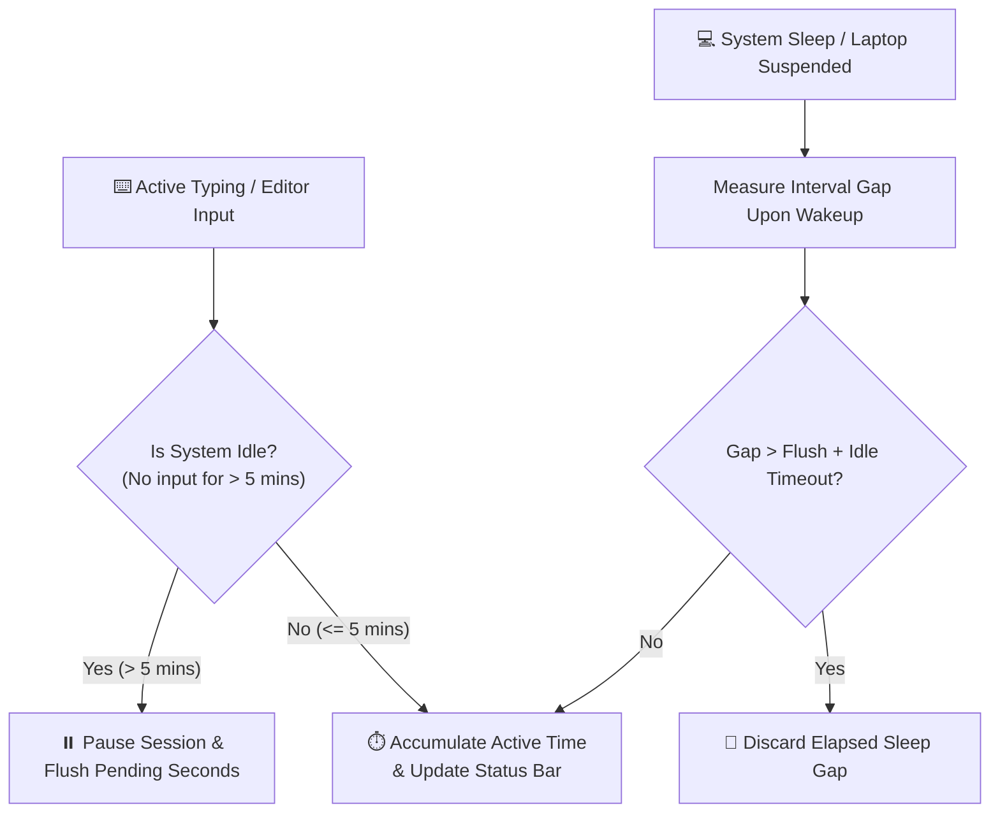
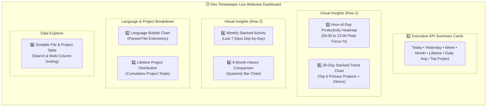
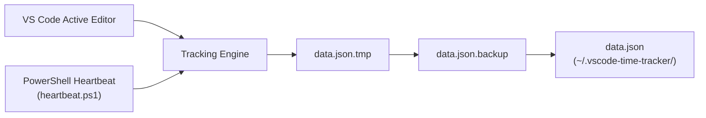

# ⏱️ Dev Timekeeper

[](LICENSE)
[](https://github.com/debjyoti71/time_extension/issues)
[](package.json)
[](https://code.visualstudio.com/)
[](#-privacy--data-security-architecture)

> **Private, offline-first coding time tracker for VS Code.**  
> Automatically records your active coding time per file, directory, workspace, day, and hour—with zero cloud dependencies, zero accounts, and zero telemetry.

---

## 🌟 Highlights & Capabilities

- 🛡️ **100% Local & Offline**: All data is stored locally in `~/.vscode-time-tracker/` (JSON). No data ever leaves your computer.
- ⚡ **Precision Idle & Sleep Detection**: Uses an OS-level background input heartbeat combined with gap-rejection algorithms so AFK time, system sleep, and laptop suspension are never counted.
- 📊 **Rich 8-Section Live Webview Dashboard**: Real-time stats, 30-day trends, weekly stacked charts, 6-month historical comparisons, hour-of-day peak productivity heatmap, language bubble map, and sortable tables.
- 📸 **Visual Share Card Generator**: Render and export sleek, customizable summary graphics directly to `.png` with one-click OS file manager integration.
- 📂 **Multi-Workspace & Project Auto-Mapping**: Automatically attributes active editor files to their respective git repositories or root workspace folders, while filtering out system junk (`AppData`, `node_modules`, `site-packages`, `temp`).
- 🎨 **Customizable Layout**: Hide or reveal dashboard sections according to your workflow preference; layout settings persist across sessions.

---

## 🧠 How the Active Tracking Engine Works

Unlike basic activity timers that continuously increment whenever VS Code is open, **Dev Timekeeper** enforces strict active-time verification.



### 1. OS-Level Idle Detection (`heartbeat.ps1`)
- Runs a lightweight background process monitoring user interaction timeouts.
- Automatically pauses active session accumulation if no keyboard or mouse input occurs for **5 minutes** (`300,000 ms`).

### 2. Suspension & Sleep Rejection
- When your machine enters sleep mode or VS Code is suspended, the timer interval measures the gap upon wakeup.
- If the time delta exceeds `Flush Interval + Idle Timeout`, elapsed sleep time is automatically discarded, preserving exact active coding statistics.

### 3. Active Window Focus Monitoring
- Instantly pauses when VS Code loses window focus, and resumes seamless tracking when you return to your active editor.

---

## 📊 The 8 Dashboard Visual Analytics Sections

Open the dashboard anytime by clicking the status bar item or running `Time Tracker: Show Dashboard`.



1. **Overview Cards**: Quick KPI summary of Today, Yesterday, This Week, Last Week, This Month, Last Month, Active Days, Daily Average, Lifetime Coding Time, and Top Project.
2. **Hour-of-Day Productivity Heatmap**: Shows the percentage of each clock hour (00:00 to 23:00) spent coding over the last 30 days, helping you identify your peak focus hours.
3. **Lifetime Per-Project Breakdown**: Comparative lifetime metrics for all active projects.
4. **Weekly Stacked Activity**: Day-by-day stacked breakdown for the last 7 days.
5. **30-Day Trend Chart**: Interactive stacked area chart detailing your top 6 primary projects alongside aggregated secondary projects.
6. **6-Month History Comparison**: High-level bar chart tracking monthly totals across the last two quarters.
7. **Language Distribution Chart**: Automatic language detection based on extension parsing (`TypeScript`, `Python`, `JavaScript`, `CSS`, `HTML`, `Go`, `Rust`, `C++`, `Java`, `SQL`, etc.).
8. **Sortable File & Project Table**: Detailed breakdown of every project and file tracked, supporting column sorting and instant search filtering.

---

## 📸 Visual Share Card Generator

Transform your coding milestones into exportable PNG graphics:

1. Open Command Palette (`Ctrl+Shift+P` / `Cmd+Shift+P`).
2. Run **`Time Tracker: Generate Share Card`**.
3. Select projects, customize date range (Last 7 Days, Last 30 Days, or Custom), and click **Export PNG**.
4. The extension opens a native OS Save Dialog and provides a **Show in Folder** shortcut upon save.

---

## ⌨️ Command Reference

| Command Title | Identifier | Action |
| --- | --- | --- |
| **Time Tracker: Show Dashboard** | `timetracker.showDashboard` | Opens the interactive real-time Webview dashboard |
| **Time Tracker: Generate Share Card** | `timetracker.shareCard` | Launches the share card builder & PNG exporter |
| **Time Tracker: Reset All Data** | `timetracker.reset` | Prompts confirmation (`RESET`) and clears local data |

---

## 🔒 Privacy & Data Security Architecture

Dev Timekeeper is built around strict data privacy principles:



- **Zero Cloud Calls**: No network requests, external APIs, telemetry, or remote analytics.
- **Local Storage Directory**: All persistent records are stored in your user home directory:
  - Data File: `~/.vscode-time-tracker/data.json`
  - Settings File: `~/.vscode-time-tracker/settings.json`
  - Idle Heartbeat File: `~/.vscode-time-tracker/heartbeat.json`
- **Atomic File Writes**: To prevent data corruption during unexpected shutdowns, storage updates write to `data.json.tmp`, backup existing data to `data.json.backup`, and perform atomic renames.
- **Automated Junk Filtering**: Path normalization automatically excludes temporary files, virtual environments, system caches (`AppData`, `site-packages`, `temp`, `.aws`, `.zip`).

---

## 📦 Installation & Setup

### Option 1: Install from VSIX Release (Recommended)
1. Download the latest `.vsix` package from [Releases](https://github.com/debjyoti71/time_extension/releases).
2. Open VS Code → Extensions tab (`Ctrl+Shift+X` / `Cmd+Shift+X`).
3. Click the `...` menu in the top-right corner → **Install from VSIX...**
4. Choose the downloaded `dev-timekeeper-*.vsix` file.

### Option 2: Build from Source
```bash
# Clone the repository
git clone https://github.com/debjyoti71/time_extension.git
cd time_extension

# Install dependencies
npm install

# Compile TypeScript
npm run compile

# Package VSIX extension package
npm run package:vsix
```

---

## 📚 Documentation Hub

For full technical documentation, architecture specs, and developer guides, explore the [`docs/`](docs) directory:
- 📖 [Product Specification](docs/PRODUCT.md) — Feature requirements, user stories, and data schemas.
- 📐 [Design Document](docs/DESIGN.md) — System architecture, event lifecycle, and UI component designs.
- 🛠️ [Developer Guide](docs/DEVELOPER.md) — Local development workflow, build scripts, and testing setups.

---

## 🐞 Issues & Community Support

Contributions, bug reports, and feature suggestions are welcome!

- 🐛 **[Report a Bug](https://github.com/debjyoti71/time_extension/issues/new?assignees=&labels=bug&projects=&template=bug_report.md&title=%5BBug%5D+)** — Encountered an issue? Open a bug report with reproduction steps.
- 💡 **[Request a Feature](https://github.com/debjyoti71/time_extension/issues/new?assignees=&labels=enhancement&projects=&template=feature_request.md&title=%5BFeature%5D+)** — Have an idea for a new dashboard chart or tracking feature? Submit a feature request.
- 💬 **[View All Issues](https://github.com/debjyoti71/time_extension/issues)** — Browse ongoing discussions and reported issues.

---

## 📄 License & Author

Distributed under the **MIT License**. See [`LICENSE`](LICENSE) for full details.

Developed by **Debjyoti Ghosh** — [https://debjyoti-ghosh.in/](https://debjyoti-ghosh.in/)
